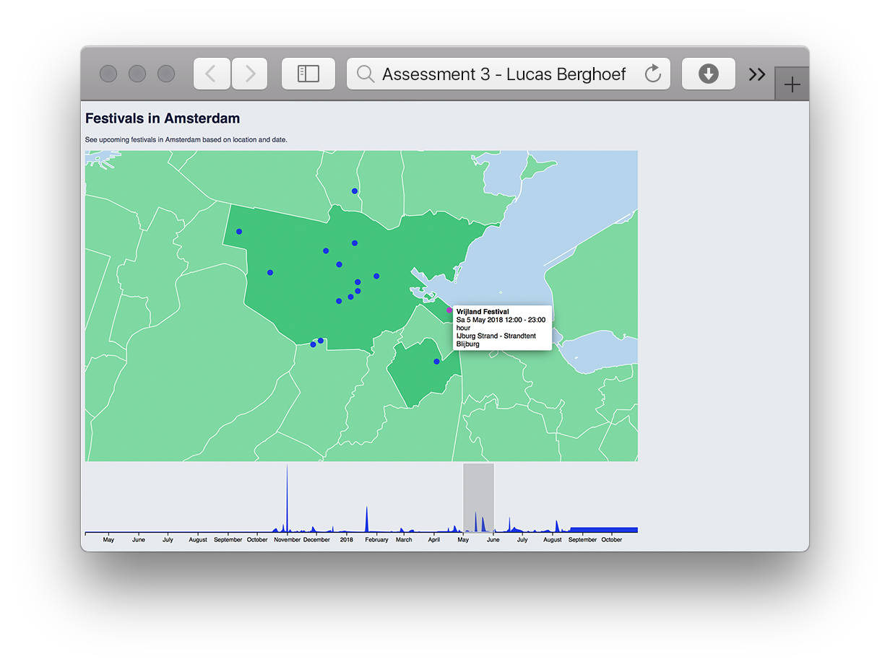

# Assessment 3 - Lucas Berghoef

In this last assessment for Frontend 3 I made multiple visualisations based on dirty data,
interacting with one another.

It consists of the following:
* a map of Amsterdam with dots representing festival locations
* a brush with an area graph containing the amount of festivals per day over time

I used the following examples and data:
* Map of the Netherlands .JSON from: https://github.com/deldersveld/topojson
* Map functionality based on: http://mapstarter.com
* Brush based on: https://github.com/cmda-fe3/course-17-18/tree/master/site/class-4/brush
* Tooltip based on: https://bl.ocks.org/d3noob/257c360b3650b9f0a52dd8257d7a2d73
* Data by Data Amsterdam: https://open.data.amsterdam.nl/Festivals.csv




# Data

### Upcoming festivals in Amsterdam

All festivals in Amsterdam and the surrounding area as definined by "Amsterdam Marketing". This file gets updated daily with the latest Festivals and only contains upcoming Festivals, not past ones. (My version was downloaded on October 11th 2017) Data from [`data.amsterdam.nl`][https://open.data.amsterdam.nl/Festivals.csv].

### Download link

https://data.amsterdam.nl/#?dte=catalogus%2Fapi%2F3%2Faction%2Fpackage_show%3Fid%3Ddf29c7bd-f34f-4ee3-9b4d-71b3e6aed791&dtfs=T&dsf=groups::toerisme-cultuur:res_format::CSV&mpb=topografie&mpz=11&mpv=52.3731081:4.8932945

### Format

Comma-separated values (CSV) with 169 rows and 25 columns:

*   `Trcid` — (ex. "04197e05-4fde-441f-a3bc-69f758e76202")
*   `Title` — Title of the festival in Dutch
*   `Shortdescription` — A short description of the festival in Dutch
*   `Longdescription` — A long description of the festival in Dutch
*   `Calendarsummary` — A summary of the date, year and time when the festival takes place in Dutch
*   `TitleEN` — Title of the festival in English
*   `ShortdescriptionEN` — A short description of the festival in English
*   `LongdescriptionEN` — A long description of the festival in English
*   `CalendarsummaryEN` — A summary of the date, year and time when the festival takes place in English
*   `Types` — N/A (Always empty in the data)
*   `Ids` — ID numbers (ex. "2.4.1")
*   `Locatienaam` — The name of the festival location
*   `City` — The name of the city the festival is held in
*   `Adres` — The adress of the festival
*   `Zipcode` — The Zip code of the festival
*   `Latitude` — The latitude of the festival location
*   `Longitude` — The longitude of the festival location
*   `Urls` — The link to the website of the festival
*   `Media` — Media (images) of the festival
*   `Thumbnail` — A thumbnail image of the festival
*   `Datepattern_startdate` — The starting date of the festival
*   `Datepattern_enddate` — The ending date of the festival
*   `Singledates` — Date & year of the festival (DD-MM-YYYY)
*   `Type1` — N/A (Always empty in the data)
*   `Lastupdated` — When the festival information was last updated

### Example

```csv
"Trcid";"Title";"Shortdescription";"Longdescription";"Calendarsummary";"TitleEN";"ShortdescriptionEN";"LongdescriptionEN";"CalendarsummaryEN";"Types";"Ids";"Locatienaam";"City";"Adres";"Zipcode";"Latitude";"Longitude";"Urls";"Media";"Thumbnail";"Datepattern_startdate";"Datepattern_enddate";"Singledates";"Type1";"Lastupdated";
"04197e05-4fde-441f-a3bc-69f758e76202";"Nationale Tulpendag";"In Amsterdam wordt elk jaar in januari tijdens de Nationale Tulpendag de officiële aftrap gegeven voor het tulpenseizoen. Iedereen mag gratis op de Dam tulpen plukken in een speciaal aangelegde pluktuin. Kom naar de Dam op de opening van De Nationale Tulpendag.";"<h2>Gratis tulpen plukken </h2> Elk jaar zorgen ... je eigen tulpen plukt op de Dam!";"Za 20 januari 2018, Toelichting: Datum voor 2018 genoemd onder voorbehoud.";"National Tulip Day";"The Dutch tulip season officially ... Amsterdam?s Dam Square. ";"<h2>Tulips from Amsterdam<strong></strong></h2> Every year, an estimated ... information visit the <a target=&quot:_blank&quot:>National Tulip Day website</a>.";"Sa 20 January 2018, Explanation: Date for 2018 to be confirmed.";"";"2.4.1";"Dam";"AMSTERDAM";"Dam";"1012 JS";"52,3731270";"4,8900800";"";"https://media.iamsterdam.com/ndtrc/Images/20130116/e1fcfdcb-2293-4d2e-ae0d-82d24057b8fb.jpg,https://media.iamsterdam.com/ndtrc/Images/20130116/f19d613c-37ce-41cf-9490-a2eb0b46da2d.jpg,https://media.iamsterdam.com/ndtrc/Images/20130116/9ba9caa0-9230-4818-aee0-2e0d924cd8ad.jpg";"https://media.iamsterdam.com/ndtrc/Images/20130116/e1fcfdcb-2293-4d2e-ae0d-82d24057b8fb.jpg";"";"";"20-01-2018";"";"2017-01-23 14:10:03";
...
"82c132db-e13e-4a77-8f89-83ebe6131265";"Sidewalk Sale ? Non Fiction";"";"";"Do 26 oktober 2017 11:00 - 18:00 uur.";"Sidewalk Sale ? Non Fiction";"The American Book Center and other booksellers pitch up at De Hallen for a sale of English-language non-fiction works, on offer from ?5. Shoppers can also bring books of their own (as long as they?re undamaged) and donate them to BetterWorldBook.  ";"";"Th 26 October 2017 11:00 - 18:00 hour.";"";"2.4.6";"De Hallen Amsterdam";"AMSTERDAM";"Hannie Dankbaarpassage 33";"1053 RT";"52,3668620";"4,8688550";"";"https://media.ndtrc.nl/Images/82/82c132db-e13e-4a77-8f89-83ebe6131265/91049ead-6d3a-4bd3-8489-5eeecf3c97da.jpg";"https://media.ndtrc.nl/Images/82/82c132db-e13e-4a77-8f89-83ebe6131265/91049ead-6d3a-4bd3-8489-5eeecf3c97da.jpg";"";"";"26-10-2017";"";"2017-08-17 19:45:16";
```

# Features
* [`d3.csv`](https://github.com/d3/d3-request/blob/master/README.md#csv)- Returns a new request for the CSV file at the specified url with the default mime type text/csv.
* [`d3.time`](https://github.com/d3/d3-time-format#timeParse) - `d3.timeParse` and `d3.timeMonth` -
* [`d3.select`](https://github.com/d3/d3-selection/blob/master/README.md#selection_select) - Selects the first element that matches the specified selector string.
* [`d3.geo`](https://github.com/d3/d3-geo/blob/master/README.md#geoPath) - `d3.geoMercator` and `d3.geoPath` - Spherical Mercator projection & create a new geographic path generator.
* [`d3.json`](https://github.com/d3/d3-request/blob/master/README.md#json) - get a JSON file.
* [`d3.event`](https://github.com/d3/d3-selection/blob/master/README.md#event) - the current user event, during interaction.
* [`d3.scale`](https://github.com/d3/d3-scale) - `d3.scaleTime` and `d3.scaleLinear` - Constructs new time scale and continuous scale.
* [`d3.extent`](https://github.com/d3/d3-array/blob/master/README.md#extent) - Returns the minimum and maximum value in the given array using natural order.
* [`d3.max`](https://github.com/d3/d3-array/blob/master/README.md#max) - compute the maximum value in an array.
* [`d3.axisBottom`](https://github.com/d3/d3-axis/blob/master/README.md#axisBottom) - create a new bottom-oriented axis generator.
* [`d3.area`](https://github.com/d3/d3-shape/blob/master/README.md#area) - create a new area generator.
* [`d3.curveMonotoneX`](https://github.com/d3/d3-shape/blob/master/README.md#curveMonotoneX) - a cubic spline that, given monotonicity in x, preserves it in y.
* [`d3.brushX`](https://github.com/d3/d3-brush/blob/master/README.md#brushX) - create a brush along the x-dimension.
* [`d3.event.selection.map`](https://github.com/d3/d3-selection/blob/master/README.md#event) - Create event with d3 on the brush, when `.selection` changes, `.map` gives start and end position.

# My changes in steps:  How I cleaned data & added multiple interactive visualisations

## 1. Downloading data and choosing visualisation type
First I selected my data and started thinking about ways for using it. This was done as part of the homework 'Source' of class 4.
I wanted to pick a data set that is actually relevant to my life and surroundings. So I picked data of Amsterdam and festivals, because who doesn't like festivals!?
The dataset can be used to create multiple visualisation because it contains topographic data which can be used to create a visualisation with a map, but also contains time data that can be used to sort the festivals in order of date in a timetable. So I chose to create a map and a graph with a brush.

## 2. Finding a topoJSON map of Amsterdam I can use
I tried finding a topoJSON map of Amsterdam but I was unsuccessful in that search. So after asking my teacher via Slack if he had any ideas he suggested using a topoJSON map of the Netherlands and then zooming in on Amsterdam. So I got a map of the Netherlands from [Github](https://github.com/deldersveld/topojson) and used [Mapstarter](http://mapstarter.com) to get a zoomed in view of Amsterdam and set that as a `center` so I could actually use it.

## 3. Cleaning the data: festival dates
Because I am going to be sorting the festivals on date, and the data isn't originally sorted that way I had to create an if/else statement that sorts the festivals on date.
Some festivals in the data have a start- and end date. This is why I am creating multiple individual dates with the code below. All of these dates are added into arrays.
```JS
if (d.Datepattern_startdate && d.Datepattern_enddate) {
    // If the event contains a range of dates.
    const start_date = parseTime(d.Datepattern_startdate) // Parse the start date
    const end_date = parseTime(d.Datepattern_enddate) // Same for end date
    let dateArray = [] // Create an empty array
    for (let date = start_date; date <= end_date; date.setDate(date.getDate() + 1)) {
        // Create new date objects for all dates between start and end date
        dateArray.push(date)
    }
    base.dates = dateArray // Store the dates in the base object
}
```

Other festivals in the data only have some seperate dates (i.e. if there is a gap between some of the festival dates or if the festival is only one day). That is why I am cleaning those seperately.
```JS
} else if (d.Singledates) {
    // If the event contains seperate dates.
    const dates = d.Singledates.split(',') // Create an array from the string of dates
    let dateArray = dates.map((d) => parseTime(d)) // Parse all dates using the parse function
    base.dates = dateArray // Store the dates in the base object
}
```

## 4. Cleaning the data: Setting the timeParse and creating object with static data
I had to set the timeParsing to the correct format and then I created an object with the data that I'm certain to receive. The title, date and location are later used for the tooltips.
```JS
var parseTime = d3.timeParse("%d-%m-%Y") // Set the expected format of the date indication

var base = { // Create a new object containing all data I'm certain to receive
    title: d.TitleEN,
    date: d.CalendarsummaryEN,
    location: d.Locatienaam,
    coordinates: [parseFloat(d.Longitude), parseFloat(d.Latitude)],
}
```

## 5. Brush function + cleaning the dates more
I used Titus' (wooorm's) example to setup the Brush. After setting it up I got some really strange results. I was able to resolve this by switching the x- and y axis.

I still had to create a function that counted how many festivals were taking place per date, so that amount could be set up as the y axis.
```JS
// Map loops through all objects in the data array and passes the `dates`
// to the reduce function. Then it combines all `dates` array into one array
// called `date_array`.
const date_array = data.map((d) => d.dates).reduce((a, b) => {
    return a.concat(b) // Flatten all dates for usage on the x axis
}).sort(function (a, b) {
    return a - b // Sort it on date
})

// This function creates strings (date) with the amount of festivals per date
let counts = {} // Create an object to store counts in
date_array.map((d) => { // Loop through the dates
    if (counts[d]) { // If the date exists in the `counts` object
        counts[d]++ // Increase count for date by one
    } else {
        counts[d] = 1 // Create a new date in the counts object and set it to 1
    }
})
```

The parseTime gave back some weird results in the area chart in the brush. I discovered this was because I turned the dates into strings, not actual processable dates. So I used this code to change that and additionally make it easier to access while rendering the area chart:
```JS
let new_data = [] // Create an empty array as not to overwrite the original just yet
for (let key in counts) {
    new_data.push({
        date: new Date(key), // Revert the key to a real Date object from a string
        count: counts[key] // Find the date from the `counts` object and add the corresponding count
    })
}
data = new_data // Overwrite original data object with cleaned version
```

## 6. Using the same data to create dots on the map for every festival
Now I'm are using the `.selectAll("circle")` function to create the circles on the map for every festival.
I already had the coordinates so I can use those in a projection function to change those coordinates to pixels with this code:
```JS
this.svg.selectAll("circle")
    .remove() // Remove previously rendered circles

this.svg.selectAll("circle")
    .data(data).enter()
    .append("circle") // Append a new circle
    .attr("cx", (d) => this.projection(d.coordinates)[0]) // Use the coordinates from the date
    .attr("cy", (d) => this.projection(d.coordinates)[1]) // and use projection to define the position in pixels
    .attr("r", "5px") // Set radius of the circle to 5 pixels
```
I attempted to remove and re-render the circles in a single iteration of the `selectAll` function but was unfortunately unable to get this to work.

I ran into trouble with this function, after setting it up there were no circles appearing on the map.
But after checking the console log I noticed that the circles were being created, they just didnt show up on the map.
After much troubleshooting I eventually discovered that this was caused by wrong interpretation of the coordinates.
I had to do some more cleaning at this point to replace the European number notation with American:
```JS
        d.Latitude = d.Latitude.replace(',', '.') // Replace European number notation with American
        d.Longitude = d.Longitude.replace(',', '.')
```

## 7. Making the brush and the map interact with eachother
Now I have to make sure the map only shows the dots for the festivals selected in the brush.
So first I sent the position of the brush to the map with this function:
```JS
brushed() {
    // Retreives the start and end position of the brush
    var d = d3.event.selection.map(this.position.x.invert)
    // Passes it to the `handleBrush` function in the App class,
    // which in turn will send it to the map.
    this.handleBrush({
        start: d[0],
        end: d[1]
    })
}
```
The `handleBrush` function is actually part of the `App` class allowing me te retreive the data from the brush class and send it to the map.

And then I only render the circles between the dates selected in the brush with this function:
```JS
// Render dots based on the range (defined by the brush)
renderEvents(range = null) {
    // Create a new variable for the data, as I'm about to filter it
    // and would rather not change the original
    let data = this.data
    if (range) { // If range is provided
        data = this.data.filter((base) => {
            for (let date of base.dates) {
                // Only return events that have a date in between the range
                if (date >= range.start && date <= range.end) return base
            }
            return // Or don't return anything
        })
    }
}
```

## 8. Creating tooltips
Next up I created a tooltip that shows the name of the festival, the date summary and the location.
This way the user can see more details about the festival they are hovering on.
```Js
.on("mouseover", (d) => { // When hovering over a circle
    this.tooltip.transition() // Fade in the tooltip
        .duration(200)
        .style("opacity", 1)
    // Create content of the tooltip: Event title, date summary and location.
    this.tooltip.html(`<strong>${d.title}</strong><br/>${d.date.split(',')[0]}<br/>${d.location}`)
        .style("left", (d3.event.pageX + 4) + "px") // Move the tooltip to the right from the cursor
        .style("top", (d3.event.pageY - 4) + "px") // Move the tooltip down from the cursor
})
.on("mouseout", (d) => { // When hovering out of a circle
    this.tooltip.transition()
        .duration(500)
        .style("opacity", 0) // Slowly fade out the tooltip
})
```

## 9. Styling the visualisations to make it more readable
After that I did some styling in the CSS file to change the colours to my liking.
This way the area chart below the map became more visible and I highlighted the area of Amsterdam for more clarity.
Some styling applied in the JavaScript using the `attr` function was removed as they were being overwritten in the stylesheets anyway.
I also increased the heigth of the area chart so that it became more readable for the user.


# Biggest Challenges
While working on this assessment I ran into a couple of bugs that took a lot of time to resolve.
The most diffucult of which are the following:

#### 1. Making sure the area chart showed the amount of festivals per date
*   It took me quite a while to figure out why the area chart wasn't showing a logival graph, at first it was all over the place.
    I had set the dates into a string and eventually I found out the chart couldn't read that so I had to change it into actual dates (see above).

#### 2. Getting the festival locations on the map
*   While setting up the `.selectall("circle")` function was possible to do, it didn't give me any results on the map.
    It took me quite some time of troubleshooting and testing a lot of options before me and my duck found out it was caused by wrong number notation (see above).


# To Do

* 1. Create a horizontal bar chart with the festivals that more closely resembles a timetable.
* 2. Add a zoom function to the map so users can take a closer look when festival dots are cluttered
* 3. Add more detail to the map (i.e. streets etc.). Perhaphs with google maps?
* 4. Add even more information to the tooltip so users can learn a lot about the festivals and maybe even visit their websites
* 5. Look into the data as to why there is a huge spike in november 2017 and a strange flat bar in september/october 2018.

# License

MIT © Lucas Berghoef
